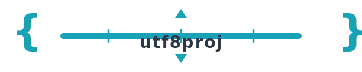

<div align="center">
  

  # utf8proj

  **Git-Native Project Scheduling Engine for Rust**
</div>

[](https://crates.io/crates/utf8proj)
[](https://docs.rs/utf8proj)
[](LICENSE)

utf8proj is a modern project scheduling library and CLI written in Rust. Define your projects in a simple text format, and utf8proj will compute schedules, identify critical paths, and generate Gantt charts.

**[Try the Interactive Demo →](https://alanbld.github.io/utf8proj/)** - No installation required, runs in your browser via WebAssembly.

## Features

- 📝 **Text-based DSL** - Version control friendly, diff-able project definitions
- ⚡ **Fast scheduling** - Heuristic-based scheduling for interactive use
- 🧠 **Smart analysis** - BDD-powered what-if analysis and solution counting
- 📊 **Multiple outputs** - SVG Gantt charts, tables, iCal, MS Project XML
- 🔌 **Embeddable** - Use as a library in your Rust applications
- 📄 **Document integration** - Native integration with utf8dok

## Quick Start

### Installation

```bash
cargo install utf8proj
```

### Create a project file

```
# project.proj

project "Website Redesign" {
    start: 2025-02-01
    currency: USD
}

resource designer "UI Designer" { rate: 750/day }
resource developer "Developer" { rate: 850/day }

task design "Design Phase" {
    task wireframes "Wireframes" { effort: 3d, assign: designer }
    task mockups "Mockups" { effort: 5d, assign: designer, depends: wireframes }
}

task development "Development" {
    depends: design
    
    task frontend "Frontend" { effort: 10d, assign: developer }
    task backend "Backend" { effort: 8d, assign: developer }
}

task launch "Launch" {
    depends: development
    duration: 1d
    milestone: true
}
```

### Generate schedule

```bash
# Show version
utf8proj --version

# Validate project (fast, no scheduling output)
utf8proj check project.proj
utf8proj check --strict project.proj    # Warnings become errors

# Compute and display schedule
utf8proj schedule project.proj
utf8proj schedule -l project.proj       # Enable resource leveling
utf8proj schedule -w 80 project.proj    # Custom column width (default: 40)
utf8proj schedule -V project.proj       # Verbose: show [task_id] Display Name
utf8proj schedule --task-ids project.proj  # Show task IDs only

# Output formats
utf8proj schedule project.proj -o schedule.json --format json
utf8proj schedule --quiet project.proj  # Suppress output except errors

# Generate Gantt chart
utf8proj gantt project.proj -o timeline.svg
```

## Documentation

- [Quick Reference](QUICK_REFERENCE.md) - DSL syntax cheat sheet
- [Grammar Specification](docs/GRAMMAR.md) - BNF grammar for `.proj` files
- [Diagnostics Reference](docs/DIAGNOSTICS.md) - Error codes and messages
- [User Guide](docs/user-guide.md) - Comprehensive documentation
- [API Reference](https://docs.rs/utf8proj) - Rust API documentation

## Comparison

| Feature | utf8proj | TaskJuggler | MS Project |
|---------|----------|-------------|------------|
| Language | Rust | Ruby | Proprietary |
| License | MIT/Apache-2.0 | GPL-2.0 | Commercial |
| Single binary | ✅ | ❌ | ❌ |
| Text-based input | ✅ | ✅ | ❌ |
| Resource leveling | ✅ | ✅ | ✅ |
| What-if (BDD) | ✅ | ❌ | ⚠️ |
| MS Project interop | ✅ | ⚠️ | ✅ |

## Library Usage

```rust
use utf8proj_core::{Project, Task, Resource, Duration};
use utf8proj_solver::HeuristicScheduler;

let project = Project::new("My Project")
    .start("2025-02-01")
    .resource(Resource::new("dev").capacity(1.0))
    .task(Task::new("design").effort(Duration::days(5)))
    .task(Task::new("implement")
        .effort(Duration::days(10))
        .depends_on("design")
        .assign("dev"));

let scheduler = HeuristicScheduler::default();
let schedule = scheduler.schedule(&project)?;

println!("Project ends: {}", schedule.project_end);
println!("Critical path: {:?}", schedule.critical_path);
```

## Feature Flags

```toml
[dependencies]
utf8proj = "0.2"                    # Heuristic scheduler only
utf8proj = { version = "0.2", features = ["bdd"] }      # + BDD analysis
utf8proj = { version = "0.2", features = ["sat"] }      # + SAT solver
utf8proj = { version = "0.2", features = ["lua"] }      # + Lua scripting
utf8proj = { version = "0.2", features = ["full"] }     # All features
```

## utf8dok Integration

utf8proj integrates seamlessly with [utf8dok](https://github.com/utf8dok/utf8dok) for document generation:

```asciidoc
= Project Proposal

== Timeline

[[fig-timeline]]
.Project Schedule
[schedule, report=gantt]
----
include::project.proj[]
----

== Resource Allocation

[[tbl-resources]]
.Team Assignment
[schedule, report=table, type=resources]
----
include::project.proj[]
----
```

## Contributing

Contributions are welcome! Please read [CONTRIBUTING.md](CONTRIBUTING.md) before submitting PRs.

### Development

```bash
git clone https://github.com/utf8dok/utf8proj
cd utf8proj
cargo build --workspace
cargo test --workspace
```

## License

Licensed under either of:

- Apache License, Version 2.0 ([LICENSE-APACHE](LICENSE-APACHE) or http://www.apache.org/licenses/LICENSE-2.0)
- MIT license ([LICENSE-MIT](LICENSE-MIT) or http://opensource.org/licenses/MIT)

at your option.

## Acknowledgments

utf8proj is inspired by [TaskJuggler](https://taskjuggler.org/), a pioneering text-based project management tool. utf8proj is a clean-room implementation that does not share code with TaskJuggler.

## Logo

<picture>
  <source srcset="docs/logos/logo-horizontal-dark.svg" media="(prefers-color-scheme: dark)">
  
</picture>

The utf8proj logo features curly braces `{ }` representing text-based project files, a timeline bar with tick marks for Gantt charts, and dependency triangles for critical path visualization.

**Available variants:**
- [logo.svg](docs/logos/logo.svg) — Main logo (400×200)
- [logo-horizontal.svg](docs/logos/logo-horizontal.svg) — Banner for headers
- [logo-horizontal-dark.svg](docs/logos/logo-horizontal-dark.svg) — Dark mode variant
- [logo-horizontal-mono.svg](docs/logos/logo-horizontal-mono.svg) — Print/monochrome
- [logo-icon.svg](docs/logos/logo-icon.svg) — Favicon/app icon (128×128)

**License:** Same as the project (MIT/Apache-2.0). See [docs/logos/README.md](docs/logos/README.md) for usage guidelines.
