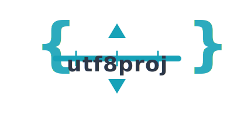

<div align="center">
  

  # utf8proj

  **Explainable, deterministic project scheduling from plain text.**<br>
  CLI + LSP + WebAssembly — schedules you can read, diff, and trust.
</div>

<p align="center">
  <a href="https://github.com/alanbld/utf8proj/actions"></a>
  <a href="LICENSE"></a>
  <a href="https://www.rust-lang.org/"></a>
  <a href="https://alanbld.github.io/utf8proj/"></a>
</p>

<p align="center">
  <strong><a href="https://alanbld.github.io/utf8proj/">🚀 Try the Interactive Demo</a></strong> — no install, runs in your browser
</p>

<p align="center">
  <a href="https://youtu.be/rp5juOZq1J0?si=cG9Q81jB3y7hFusB">
    
  </a>
  <br>
  <sub>▶️ Watch: 3-minute overview (AI-generated with NotebookLM)</sub>
</p>

---

## Why utf8proj?

- **Explainable** — Every scheduling decision has a traceable diagnostic code. No black boxes.
- **Deterministic** — Same input always produces the same output. Perfect for CI/CD and audits.
- **Git-friendly** — Plain text `.proj` files you can diff, review, and version control.

---

## Quick Start (60 seconds)

**1. Create `example.proj`:**

```proj
project "Sprint 1" { start: 2025-02-01 }

resource dev "Developer" { rate: 850/day }

task design "Design" { effort: 3d, assign: dev }
task build "Build" { effort: 5d, assign: dev, depends: design }
milestone done "Done" { depends: build }
```

**2. Install and run:**

```bash
cargo install --path crates/utf8proj-cli
utf8proj schedule example.proj
```

**3. Or try instantly in the browser:** [alanbld.github.io/utf8proj](https://alanbld.github.io/utf8proj/)

---

## What You Get

| Component | Purpose |
|-----------|---------|
| `utf8proj` CLI | Schedule, validate, render Gantt charts |
| `utf8proj-lsp` | IDE support: hover, go-to-definition, diagnostics |
| WASM Playground | Browser-based scheduling with live preview |
| Renderers | HTML, SVG, Mermaid, PlantUML, Excel (XLSX) |

### Scheduling & Analysis
- **CPM Scheduling** — Critical path with FS/SS/FF/SF dependencies and lag
- **Resource Leveling** — Deterministic conflict resolution with audit trail
- **Calendar-Aware** — Working days, weekends, holidays with impact analysis
- **Progress Tracking** — Status date, remaining duration, earned value (SPI)
- **Focus View** — Filter large Gantt charts by task prefix

### 40+ Diagnostic Codes
Every decision is explained:
- **E***: Errors (circular deps, infeasible constraints)
- **W***: Warnings (overallocation, wide cost ranges)
- **L***: Leveling decisions (L001-L004)
- **C***: Calendar impact (C001-C023)
- **P***: Progress tracking (P005-P006)

---

## CLI Examples

```bash
# Validate (fast, CI-friendly)
utf8proj check project.proj --strict

# Schedule with leveling
utf8proj schedule -l project.proj

# Interactive HTML Gantt
utf8proj gantt project.proj -o timeline.html -f html

# Excel workbook with calendar analysis
utf8proj gantt project.proj -o report.xlsx -f xlsx --include-calendar

# Focus on specific tasks
utf8proj gantt project.proj -o backend.html -f html --focus="backend"
```

---

## Library Usage

```rust
use utf8proj_core::{Project, Task, Resource, Duration, Scheduler};
use utf8proj_solver::CpmSolver;

let mut project = Project::new("My Project");
project.start = chrono::NaiveDate::from_ymd_opt(2025, 2, 1).unwrap();
project.tasks = vec![
    Task::new("design").effort(Duration::days(5)),
    Task::new("build").effort(Duration::days(10)).depends_on("design"),
];

let solver = CpmSolver::with_leveling();
let schedule = solver.schedule(&project)?;
println!("Critical path: {:?}", schedule.critical_path);
```

---

## Documentation

| Document | Purpose |
|----------|---------|
| [Quick Reference](QUICK_REFERENCE.md) | DSL syntax cheat sheet |
| [Grammar Spec](docs/GRAMMAR.md) | Complete `.proj` syntax |
| [Diagnostics](docs/DIAGNOSTICS.md) | All diagnostic codes |
| [Editor Setup](docs/EDITOR_SETUP.md) | VS Code, Neovim, Vim, Zed |
| [Explainability Manifesto](docs/EXPLAINABILITY.md) | Design philosophy |

---

## Comparison

| Feature | utf8proj | TaskJuggler | MS Project |
|---------|----------|-------------|------------|
| File Format | Text (.proj) | Text (.tjp) | Binary (.mpp) |
| Version Control | Excellent | Good | Poor |
| Explainability | First-class | Limited | None |
| Resource Leveling | Deterministic | Optimizer | Black box |
| License | MIT/Apache-2.0 | GPL-2.0 | Commercial |
| Single Binary | Yes | No (Ruby) | No |

---

## Development

```bash
git clone https://github.com/alanbld/utf8proj
cd utf8proj
cargo build --workspace
cargo test --workspace
```

---

## License

Licensed under [MIT](LICENSE-MIT) or [Apache-2.0](LICENSE-APACHE), at your option.

---

<div align="center">
  <sub>Built with Rust. Designed for transparency.</sub>
</div>
