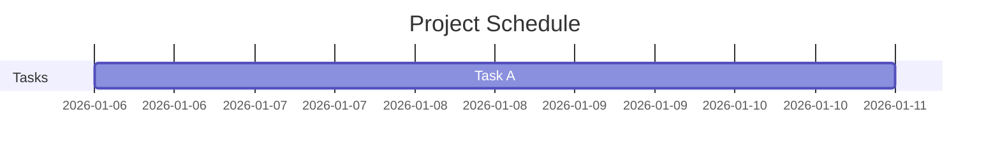

# RFC-0017: Now Line Rendering

**RFC Number:** 0017
**Status:** Implemented
**Created:** 2026-01-29
**Related:** RFC-0008 (Progress-Aware CPM), RFC-0016 (Playground Audit Console)

---

## Summary

Add vertical "now line" markers to Gantt chart renderers, showing the current date and/or status date as visual reference points. This includes CLI, WASM playground, parser fixes, and documentation updates to align with MS Project and TaskJuggler conventions.

## Motivation

Project managers need visual reference points on Gantt charts to:
1. **See "where we are"** - A vertical line showing today's date
2. **Track reporting date** - When status_date differs from today (e.g., weekly status meetings report as-of last Friday)
3. **Identify slippage** - Tasks whose bars extend past the now line are potentially behind schedule

Currently, utf8proj's HTML/SVG and MermaidJS renderers lack this essential visual cue. PlantUML has partial support (`show_today()`), but it doesn't integrate with `status_date`.

## Industry Analysis

### MS Project
- **Current Date Line**: Green dashed vertical line (always visible by default)
- **Status Date Line**: Red solid vertical line (off by default, requires explicit enable)
- Two distinct concepts: "today" (system clock) vs "status date" (reporting baseline)

### TaskJuggler
- **`now`**: Project attribute setting the reporting date (red line)
- **`markdate`**: Additional reference line for custom tracking (black line)
- If `now` not specified, defaults to system clock

### utf8proj Current State
- `project.status_date` and `--as-of` CLI flag already implemented (RFC-0008)
- Resolution: `--as-of CLI > project.status_date > today()`
- PlantUML has `show_today()` but doesn't use resolved status_date
- HTML/SVG and MermaidJS have no now line support

## Design

### Temporal Reference Model

```
┌─────────────────────────────────────────────────────────────────┐
│ Two Reference Points                                            │
├─────────────────────────────────────────────────────────────────┤
│                                                                 │
│  TODAY        = System clock date                               │
│                 Always available, no user input needed          │
│                                                                 │
│  STATUS_DATE  = Reporting/calculation date                      │
│                 Resolution: --as-of > project.status_date > today│
│                                                                 │
│  When status_date == today: Show single line (status_date wins) │
│  When status_date != today: Show both lines with distinct style │
│                                                                 │
└─────────────────────────────────────────────────────────────────┘
```

### CLI Interface

```bash
# Default: show status_date line (resolved per RFC-0008)
utf8proj gantt project.proj -o chart.svg

# Explicit status date override
utf8proj gantt project.proj -o chart.svg --as-of 2026-01-20

# Disable now line
utf8proj gantt project.proj -o chart.svg --no-now-line

# Show both today and status_date (when different)
utf8proj gantt project.proj -o chart.svg --show-today
```

### Parameters

| Parameter | Type | Default | Description |
|-----------|------|---------|-------------|
| `--as-of` | Date | None | Override status_date (existing RFC-0008 flag) |
| `--no-now-line` | Flag | false | Disable now line rendering entirely |
| `--show-today` | Flag | false | Show today line even when status_date differs |

### Visual Styling

| Line | Color | Style | Label | Visibility |
|------|-------|-------|-------|------------|
| Status Date | `#E53935` (red) | Solid 2px | "Status: YYYY-MM-DD" | Default ON |
| Today | `#43A047` (green) | Dashed 2px | "Today" | Only when `--show-today` and differs from status_date |

### Rendering Behavior

```
Timeline Header:
  Jan 6   Jan 13   Jan 20   Jan 27   Feb 3
    │        │        │    ┃   │        │
────┼────────┼────────┼────╋───┼────────┼────
    │        │        │    ┃   │        │
                           ┃
                    Status: Jan 22
                    (red solid line)
```

When `--show-today` and status_date != today:
```
  Jan 6   Jan 13   Jan 20   Jan 27   Feb 3
    │        │        │    ┃   ┊        │
────┼────────┼────────┼────╋───┊────────┼────
    │        │        │    ┃   ┊        │
                           ┃   ┊
                    Status ┃   ┊ Today
                    Jan 22     Jan 29
              (red solid)  (green dashed)
```

### Data Structures

```rust
/// Configuration for now line rendering
#[derive(Clone, Debug, Default)]
pub struct NowLineConfig {
    /// The resolved status date (from --as-of, project.status_date, or today)
    pub status_date: Option<NaiveDate>,
    /// Whether to show the today line separately (when different from status_date)
    pub show_today: bool,
    /// Disable now line rendering entirely
    pub disabled: bool,
}

impl NowLineConfig {
    /// Create config with status date line enabled
    pub fn with_status_date(date: NaiveDate) -> Self {
        Self {
            status_date: Some(date),
            show_today: false,
            disabled: false,
        }
    }

    /// Also show today line when it differs from status_date
    pub fn with_today(mut self) -> Self {
        self.show_today = true;
        self
    }

    /// Disable all now line rendering
    pub fn disabled() -> Self {
        Self {
            status_date: None,
            show_today: false,
            disabled: true,
        }
    }
}
```

### Renderer API Changes

```rust
// HTML/SVG Gantt renderer
impl HtmlGanttRenderer {
    /// Configure now line rendering
    pub fn with_now_line(mut self, config: NowLineConfig) -> Self {
        self.now_line_config = config;
        self
    }
}

// MermaidJS renderer
impl MermaidRenderer {
    /// Configure now line rendering
    pub fn with_now_line(mut self, config: NowLineConfig) -> Self {
        self.now_line_config = config;
        self
    }
}
```

### HTML/SVG Implementation

The now line is rendered in the grid area as a vertical line spanning the full chart height:

```rust
fn render_now_line(&self, config: &NowLineConfig, chart_start: NaiveDate,
                   day_width: f64, chart_height: f64) -> String {
    let mut lines = String::new();

    if config.disabled {
        return lines;
    }

    // Status date line (primary)
    if let Some(status_date) = config.status_date {
        let x = self.date_to_x(status_date, chart_start, day_width);
        if x >= 0.0 && x <= self.chart_width {
            lines.push_str(&format!(
                r#"<line class="now-line status-date" x1="{x}" y1="0" x2="{x}" y2="{h}" />"#,
                x = x, h = chart_height
            ));
            // Label
            lines.push_str(&format!(
                r#"<text class="now-line-label" x="{x}" y="-5">Status: {}</text>"#,
                x = x, status_date
            ));
        }
    }

    // Today line (secondary, only if show_today and differs)
    if config.show_today {
        let today = chrono::Local::now().date_naive();
        if config.status_date != Some(today) {
            let x = self.date_to_x(today, chart_start, day_width);
            if x >= 0.0 && x <= self.chart_width {
                lines.push_str(&format!(
                    r#"<line class="now-line today" x1="{x}" y1="0" x2="{x}" y2="{h}" />"#,
                    x = x, h = chart_height
                ));
            }
        }
    }

    lines
}
```

CSS styling:
```css
.now-line.status-date {
    stroke: #E53935;
    stroke-width: 2px;
}
.now-line.today {
    stroke: #43A047;
    stroke-width: 2px;
    stroke-dasharray: 6,4;
}
.now-line-label {
    font-size: 10px;
    fill: #E53935;
    text-anchor: middle;
}
```

### MermaidJS Implementation

MermaidJS has native `todayMarker` support:



The renderer outputs:
```rust
fn render_now_line(&self, config: &NowLineConfig) -> String {
    if config.disabled {
        return String::new();
    }

    // Mermaid's todayMarker always uses actual today
    // For status_date, we use a milestone marker instead
    if let Some(status_date) = config.status_date {
        format!(
            "    todayMarker stroke-width:2px,stroke:#E53935\n"
        )
    } else {
        String::new()
    }
}
```

**Note**: MermaidJS `todayMarker` uses actual system date. For explicit status_date different from today, we emit an invisible milestone as a workaround, or document the limitation.

### PlantUML Enhancement

Update existing `show_today()` to use resolved status_date:

```rust
impl PlantUmlRenderer {
    pub fn with_now_line(mut self, config: NowLineConfig) -> Self {
        self.now_line_config = config;
        self
    }
}

// In render():
if let Some(date) = self.now_line_config.status_date {
    output.push_str(&format!("{} is colored in LightCoral\n", date));
}
```

### WASM Playground Integration

The Playground struct gains a `show_now_line` toggle (default: true) and uses the project's `status_date` when rendering:

```rust
#[wasm_bindgen]
pub struct Playground {
    // ... existing fields ...
    /// RFC-0017: Show now line on Gantt chart
    show_now_line: bool,
}

#[wasm_bindgen]
impl Playground {
    /// Enable or disable now line rendering (default: true)
    #[wasm_bindgen]
    pub fn set_show_now_line(&mut self, enabled: bool) {
        self.show_now_line = enabled;
    }

    /// Get current now line setting
    #[wasm_bindgen]
    pub fn get_show_now_line(&self) -> bool {
        self.show_now_line
    }
}
```

In `render_gantt()`, pass the now line config:

```rust
// In render_gantt():
let now_line_config = if self.show_now_line {
    // Use project status_date, or today if not set
    let status_date = self.project.as_ref()
        .and_then(|p| p.status_date)
        .unwrap_or_else(|| chrono::Local::now().date_naive());
    NowLineConfig::with_status_date(status_date)
} else {
    NowLineConfig::disabled()
};

let renderer = HtmlGanttRenderer::new()
    .with_now_line(now_line_config)
    // ... other config ...
```

### Playground UI Updates

Add a toggle in the playground's settings panel:

```html
<!-- In playground/index.html settings panel -->
<label class="toggle-option">
    <input type="checkbox" id="nowLineToggle" checked>
    <span>Show Now Line</span>
</label>
```

```javascript
// In playground/index.html JavaScript
document.getElementById('nowLineToggle').addEventListener('change', (e) => {
    playground.set_show_now_line(e.target.checked);
    renderGantt(); // Re-render with updated setting
});
```

## Parser Updates

### TJP Parser: Process `now` Attribute

The grammar rule exists but is not processed. Add handling in `crates/utf8proj-parser/src/tjp/mod.rs`:

```rust
Rule::now_attr => {
    if let Some(date_pair) = pair.into_inner().next() {
        project.status_date = Some(parse_date(date_pair)?);
    }
}
```

### MS Project Import: Extract Status Date

Update `tools/mpp_to_proj/mpp_to_proj.py` to extract status date via MPXJ:

```python
# In convert_project():
status_date = project.project_properties.status_date
if status_date:
    proj_lines.append(f"    status_date: {status_date.strftime('%Y-%m-%d')}")
```

## Documentation Updates

### BNF Grammar (`docs/GRAMMAR.md`)

Add `status_date` to project attributes:

```bnf
<project-attr> ::= "start" ":" <date>
                 | "end" ":" <date>
                 | "currency" ":" <identifier>
                 | "calendar" ":" <identifier>
                 | "timezone" ":" <timezone-value>
                 | "status_date" ":" <date>           # RFC-0017: Add this line
```

### Cheatsheet (`docs/CHEATSHEET.md`)

Add to "Safe to Edit" table:

```markdown
| **Status Date** | `status_date: 2026-01-20` | Reporting "as-of" date |
```

Add new section:

```markdown
## Now Line / Status Date

The Gantt chart shows a vertical red line at the **status date**:

- Set in project: `status_date: 2026-01-20`
- Override via CLI: `--as-of 2026-01-20`
- If not set, defaults to today

The now line helps identify tasks that may be behind schedule.
```

### Playground Syntax Reference (`playground/syntax.html`)

Add `status_date` to the Project section:

```html
<tr>
    <td><code>status_date:</code></td>
    <td><code>status_date: 2026-01-20</code></td>
    <td>Reporting "as-of" date for progress tracking and now line</td>
</tr>
```

### CLI Help Text

Update `--as-of` help in `crates/utf8proj-cli/src/main.rs`:

```rust
/// Override status date for progress calculations and now line rendering
#[arg(long, value_name = "DATE")]
as_of: Option<String>,

/// Disable now line rendering on Gantt chart
#[arg(long)]
no_now_line: bool,

/// Show today line separately when status_date differs from today
#[arg(long)]
show_today: bool,
```

### CLAUDE.md Updates

Add to "Task attributes" section under Grammar Notes:

```markdown
**Project attributes:**
- `status_date:` - Reporting "as-of" date (used for progress calculations and now line)
```

## Implementation Plan

### Phase 1: HTML/SVG Now Line (MVP)
1. Add `NowLineConfig` struct to `utf8proj-render`
2. Implement `render_now_line()` in `gantt.rs`
3. Add `--no-now-line` and `--show-today` CLI flags
4. Pass resolved status_date from CLI to renderer
5. Unit tests for line positioning and visibility

### Phase 2: WASM Playground Integration
1. Add `show_now_line` field to `Playground` struct
2. Add `set_show_now_line()` and `get_show_now_line()` methods
3. Update `render_gantt()` to pass `NowLineConfig`
4. Add toggle in playground UI (index.html)
5. E2E tests for now line toggle

### Phase 3: Parser Fixes
1. TJP parser: handle `now_attr` → `project.status_date`
2. MS Project import: extract `ProjectProperties.status_date`

### Phase 4: MermaidJS Now Line
1. Add `todayMarker` directive output
2. Document status_date vs today limitation

### Phase 5: PlantUML Enhancement
1. Update `show_today()` to use `NowLineConfig`
2. Align with status_date semantics

### Phase 6: Documentation Updates
1. Update `docs/GRAMMAR.md` - add `status_date` to BNF
2. Update `docs/CHEATSHEET.md` - add status_date section
3. Update `playground/syntax.html` - add status_date row
4. Update `CLAUDE.md` - add status_date to grammar notes

## Test Cases

### Unit Tests (Phase 1: HTML/SVG)

1. **now_line_at_status_date**: Line rendered at correct X position
2. **now_line_outside_range**: No line when status_date outside chart range
3. **now_line_disabled**: No line when `--no-now-line`
4. **now_line_with_today**: Both lines when `--show-today` and dates differ
5. **now_line_same_date**: Single line when status_date == today
6. **now_line_label_format**: Label shows "Status: YYYY-MM-DD"
7. **now_line_css_classes**: Correct CSS classes applied

### WASM Playground Tests (Phase 2)

8. **wasm_now_line_default_enabled**: Now line shown by default
9. **wasm_set_show_now_line_false**: Now line hidden when disabled
10. **wasm_now_line_uses_status_date**: Line at project.status_date position
11. **wasm_now_line_falls_back_to_today**: Uses today when no status_date

### Parser Tests (Phase 3)

12. **tjp_now_parsed**: `now 2026-01-15` sets project.status_date
13. **mpp_status_date_imported**: MS Project status date extracted

### CLI Integration Tests

14. **cli_no_now_line_flag**: `--no-now-line` suppresses line
15. **cli_as_of_propagates**: `--as-of` date shown on chart
16. **cli_show_today_flag**: `--show-today` renders both lines

### E2E Playground Tests

17. **e2e_now_line_toggle**: Toggle checkbox enables/disables now line
18. **e2e_now_line_visible_in_gantt**: Red vertical line visible in rendered chart

## Acceptance Criteria

### Phase 1: HTML/SVG
- [x] HTML/SVG Gantt shows red vertical line at status_date
- [x] Line only rendered when date falls within chart's visible range
- [x] `--no-now-line` CLI flag disables the line
- [x] `--show-today` shows green dashed line for actual today (when different)
- [x] Line label shows formatted date

### Phase 2: WASM Playground
- [x] `set_show_now_line(bool)` method exposed to JavaScript
- [x] Now line enabled by default in playground
- [x] Toggle checkbox in playground settings panel
- [x] Now line uses `project.status_date` or falls back to today

### Phase 3: Parsers
- [x] TJP `now` attribute parsed into `project.status_date`
- [x] MS Project import extracts status date (if available)

### Phase 6: Documentation
- [x] `docs/GRAMMAR.md` includes `status_date` in BNF
- [x] `docs/CHEATSHEET.md` explains status_date usage
- [x] `playground/syntax.html` documents status_date
- [x] CLI `--help` describes now line flags

## Future Enhancements (Out of Scope)

- Custom line colors via CLI/config
- Multiple `markdate` reference lines (TaskJuggler feature)
- Interactive tooltip on hover over now line
- Excel conditional formatting for status date column

## Appendix: Format Support Matrix

| Feature | HTML/SVG | MermaidJS | PlantUML | WASM Playground |
|---------|----------|-----------|----------|-----------------|
| Status date line | Phase 1 | Phase 4 | Phase 5 | Phase 2 |
| Today line (separate) | Phase 1 | Limited* | Phase 5 | Future |
| Line label | Yes | No | No | Yes |
| Toggle on/off | CLI flag | N/A | N/A | UI checkbox |
| Configurable color | Future | No | No | Future |

*MermaidJS `todayMarker` always uses system date, not configurable status_date.
