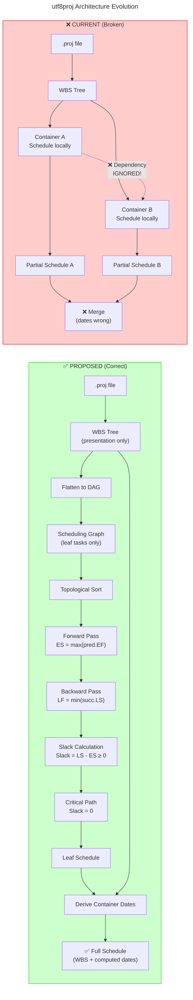
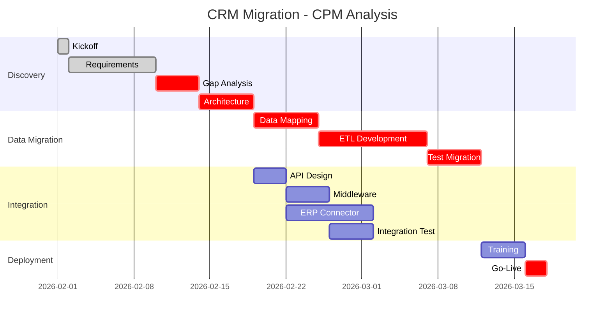
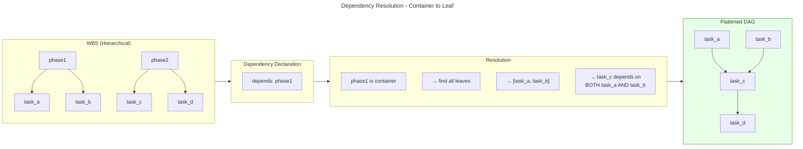
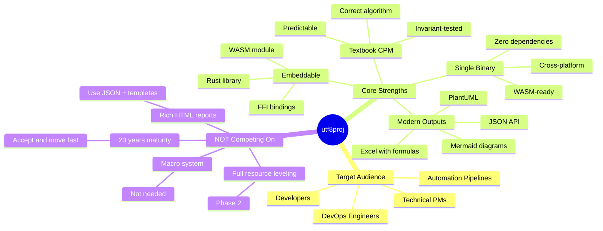
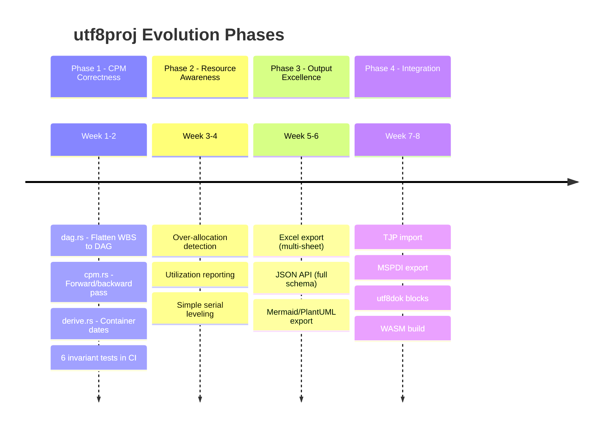

```mermaid
---
title: utf8proj Architecture Evolution
---
flowchart TB
    subgraph BEFORE["❌ CURRENT (Broken)"]
        direction TB
        P1[".proj file"] --> WBS1["WBS Tree"]
        WBS1 --> C1["Container A<br/>Schedule locally"]
        WBS1 --> C2["Container B<br/>Schedule locally"]
        C1 -.->|"❌ Dependency<br/>IGNORED!"| C2
        C1 --> S1["Partial Schedule A"]
        C2 --> S2["Partial Schedule B"]
        S1 --> M1["❌ Merge<br/>(dates wrong)"]
        S2 --> M1
    end

    subgraph AFTER["✅ PROPOSED (Correct)"]
        direction TB
        P2[".proj file"] --> WBS2["WBS Tree<br/>(presentation only)"]
        WBS2 --> F["Flatten to DAG"]
        F --> DAG["Scheduling Graph<br/>(leaf tasks only)"]
        DAG --> TS["Topological Sort"]
        TS --> FP["Forward Pass<br/>ES = max(pred.EF)"]
        FP --> BP["Backward Pass<br/>LF = min(succ.LS)"]
        BP --> SL["Slack Calculation<br/>Slack = LS - ES ≥ 0"]
        SL --> CP["Critical Path<br/>Slack = 0"]
        CP --> LS["Leaf Schedule"]
        LS --> D["Derive Container Dates"]
        WBS2 --> D
        D --> FS["✅ Full Schedule<br/>(WBS + computed dates)"]
    end

    BEFORE ~~~ AFTER

    style BEFORE fill:#ffcccc,stroke:#cc0000
    style AFTER fill:#ccffcc,stroke:#00cc00
```

---

```mermaid
---
title: CPM Forward/Backward Pass Example
---
gantt
    title CRM Migration - CPM Analysis
    dateFormat YYYY-MM-DD
    
    section Discovery
    Kickoff           :done, kick, 2026-02-01, 1d
    Requirements      :done, req, after kick, 8d
    Gap Analysis      :crit, gap, after req, 4d
    Architecture      :crit, arch, after gap, 5d
    
    section Data Migration  
    Data Mapping      :crit, map, after arch, 6d
    ETL Development   :crit, etl, after map, 10d
    Test Migration    :crit, test, after etl, 5d
    
    section Integration
    API Design        :api, after arch, 3d
    Middleware        :mid, after api, 4d
    ERP Connector     :erp, after api, 8d
    Integration Test  :int, after mid, 4d
    
    section Deployment
    Training          :train, after test, 4d
    Go-Live           :crit, go, after train, 2d
```

---

```mermaid
---
title: Dependency Resolution - Container to Leaf
---
flowchart LR
    subgraph WBS["WBS (Hierarchical)"]
        direction TB
        P1["phase1"] --> A["task_a"]
        P1 --> B["task_b"]
        P2["phase2"] --> C["task_c"]
        P2 --> D["task_d"]
    end
    
    subgraph DEP["Dependency Declaration"]
        D1["depends: phase1"]
    end
    
    subgraph RES["Resolution"]
        direction TB
        R1["phase1 is container"]
        R2["→ find all leaves"]
        R3["→ [task_a, task_b]"]
        R4["→ task_c depends on<br/>BOTH task_a AND task_b"]
    end
    
    subgraph DAG["Flattened DAG"]
        A2["task_a"] --> C2["task_c"]
        B2["task_b"] --> C2
        C2 --> D2["task_d"]
    end
    
    WBS --> DEP
    DEP --> RES
    RES --> DAG
    
    style DAG fill:#e6ffe6,stroke:#00aa00
```

---

```mermaid
---
title: Strategic Positioning
---
mindmap
    root((utf8proj))
        Target Audience
            Developers
            DevOps Engineers
            Technical PMs
            Automation Pipelines
        Core Strengths
            Single Binary
                Zero dependencies
                Cross-platform
                WASM-ready
            Modern Outputs
                JSON API
                Excel with formulas
                Mermaid diagrams
                PlantUML
            Embeddable
                Rust library
                FFI bindings
                WASM module
            Textbook CPM
                Correct algorithm
                Invariant-tested
                Predictable
        NOT Competing On
            Rich HTML reports
                Use JSON + templates
            Macro system
                Not needed
            Full resource leveling
                Phase 2
            20 years maturity
                Accept and move fast
```

---

```mermaid
---
title: Implementation Roadmap
---
timeline
    title utf8proj Evolution Phases
    
    section Phase 1 - CPM Correctness
        Week 1-2 : dag.rs - Flatten WBS to DAG
                 : cpm.rs - Forward/backward pass
                 : derive.rs - Container dates
                 : 6 invariant tests in CI
    
    section Phase 2 - Resource Awareness  
        Week 3-4 : Over-allocation detection
                 : Utilization reporting
                 : Simple serial leveling
    
    section Phase 3 - Output Excellence
        Week 5-6 : Excel export (multi-sheet)
                 : JSON API (full schema)
                 : Mermaid/PlantUML export
    
    section Phase 4 - Integration
        Week 7-8 : TJP import
                 : MSPDI export
                 : utf8dok blocks
                 : WASM build
```
